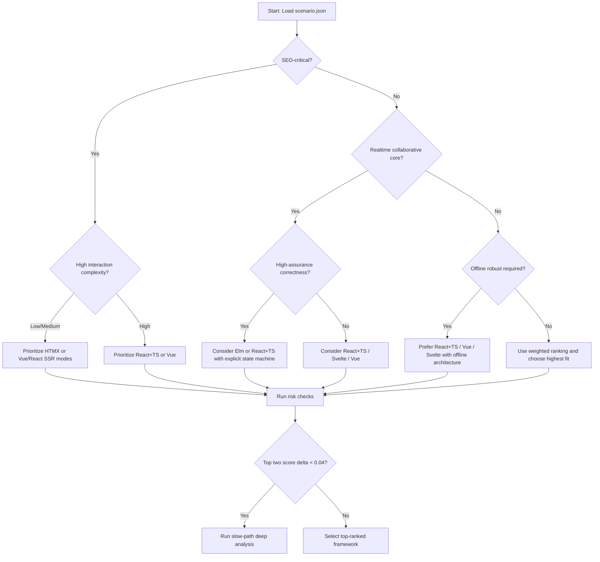

# Frontend Architecture Decision Engine - Decision Flow (Provisional)

Status: `provisional` until `docs/operations/smoke-checks.md` confirms PROMPT_04 hardening validation.

## Section 3 - Scenario Weighting System

### Input

- Scenario file validated by `schemas/scenario.schema.json`
- Weighted criteria (`0-5`) and categorical constraints

### Scoring Algorithm Logic

Given:

- `W[c]`: weight for criterion `c`
- `S[f][c]`: framework base score for criterion `c` (1-5)
- `INV = { cognitive_load, deployment_complexity }`

Formula:

1. `fit(f,c) = S[f][c]` for non-inverted criteria.
2. `fit(f,c) = 6 - S[f][c]` for inverted criteria.
3. `weighted_sum(f) = Σ (W[c] * fit(f,c))`.
4. `max_sum = Σ (W[c] * 5)`.
5. `base_score(f) = weighted_sum(f) / max_sum`.
6. Apply penalties from hard constraints (examples):
   - If `seo_critical=true` and framework SEO score <=2, `-0.12`.
   - If `assurance_level=high-assurance` and correctness <=3, `-0.10`.
   - If `offline_need=robust` and state modeling <=2, `-0.08`.
7. Clamp: `final_score(f) = max(0, min(1, base_score - penalties))`.

Confidence:

- `confidence = min(1, (non_zero_weight_count / total_criteria) * data_completeness_ratio)`

Recommendation rule:

- Return ranked frameworks by `final_score`.
- If top two delta `< 0.04`, classify as `close-call` and require architecture review.

### Example Output Ranking (from `schemas/examples/scenario.example.json`)

1. React + TS: `0.82`
2. Vue: `0.78`
3. Svelte: `0.77`
4. Elm: `0.74`
5. HTMX: `0.64`
6. Flutter Web: `0.51`

Interpretation: realtime + async + state complexity weighted high; SEO still relevant but not dominant.

## Section 4 - Decision Flow Model

### Decision Tree (text)

1. Is SEO-critical discoverability a hard requirement?
2. Is high-assurance correctness mandatory?
3. Is realtime collaboration central to core workflow?
4. Is offline robustness required?
5. What is team complexity tolerance and operational maturity?
6. Rank options via weighted scoring and apply penalties.
7. If close-call, run deep analysis and short spike before committing.

### Decision Tree (mermaid)



### Fast-path heuristic flow

1. If `seo_critical` and `interaction_density` is not high, prefer HTMX baseline.
2. If `realtime` and `state_scope` is global/collaborative, prefer React + TS or Vue.
3. If `high-assurance` correctness dominates, consider Elm first, React + TS second.
4. If cross-platform parity with mobile is hard requirement, evaluate Flutter Web despite SEO penalty.

### Slow-path deep analysis flow

1. Validate scoring input completeness and weight rationale.
2. Run algorithm and inspect top-three with penalty traces.
3. Produce explicit risk register by framework.
4. Define migration fallback from winner to runner-up.
5. Require architecture sign-off with documented override rationale if non-top choice is selected.

## Section 7 - CLI/TUI Decision Tool Scaffold

Command:

```bash
frontend-lab decide scenario.json
```

Expected output shape:

- Ranked frameworks with numeric score
- Tradeoff explanation per top candidate
- Risk warnings tied to scenario constraints
- Migration notes (winner -> runner-up)

Example CLI output:

```text
Scenario: SCN-001 (v1.0.0)
Confidence: 0.86

Ranked frameworks:
1) React + TS      score=0.82  fit=high
2) Vue             score=0.78  fit=high
3) Svelte          score=0.77  fit=high
4) Elm             score=0.74  fit=medium-high
5) HTMX            score=0.64  fit=medium
6) Flutter Web     score=0.51  fit=low

Tradeoffs:
- React + TS: strongest async/state/tooling, higher cognitive load.
- Vue: strong balance and simpler deployment profile.

Risk warnings:
- High realtime complexity raises defect risk without strict state boundaries.
- Compliance mode requires idempotency + audit trail regardless of framework.

Migration notes:
- If React + TS throughput degrades, migrate by feature boundaries toward Vue-compatible API contracts.
```

## Section 8 - Design Decision Philosophy

1. Why this engine exists:
   - Prevent architecture selection by familiarity, hype, or hiring bias alone.
   - Convert platform knowledge into reusable, auditable decision support.

2. Why frontend decisions become emotional:
   - Teams overvalue local expertise and underweight operational constraints.
   - Demo success is mistaken for production fit.

3. Why systems-level thinking prevents regret:
   - Makes constraints explicit before committing architecture.
   - Connects framework choice to delivery risk, correctness, and operations.

4. Public differentiation for this repository:
   - Not only implementation examples, but formal decision logic.
   - Enables comparable architecture decisions across scenarios over time.
