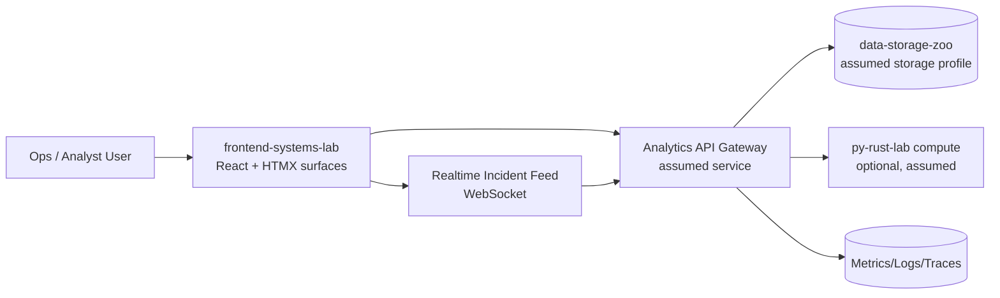
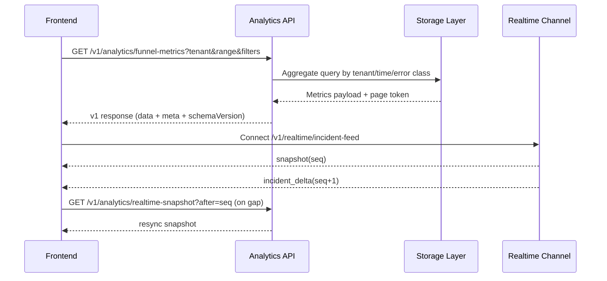
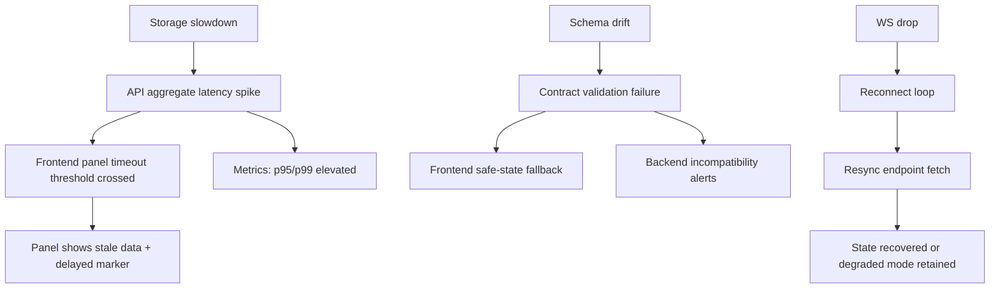

# Cross-Lab System Diagrams

Status: `integration-design`  
Boundary note: diagrams include assumed external services from unavailable repositories.

## 1) System Diagram

## 2) Data Flow Diagram

## 3) Failure Propagation Diagram

